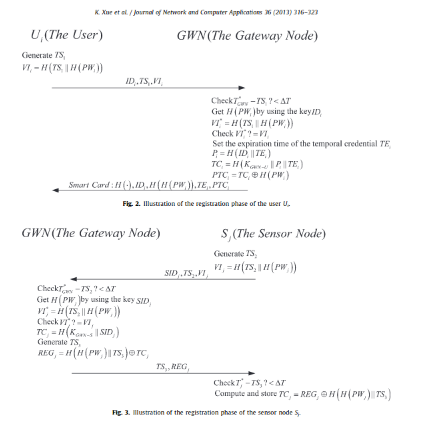
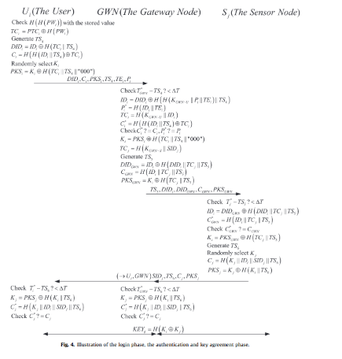

#Temporal Credential Based key Agreement Scheme For Wireless Sensor Networks

### Agents involved: A, B and C
  - A : User
  - B : Server/GateWay Node
  - C : Sensor

### Stages:
  1. Registration
     - User &#8594; Gateway
     - Gateway &#8594; User
     - Sensor &#8594; Gateway
     - Gateway &#8594; Sensor
     
  2. Login
     - User &#8594; Sensor
     
  3. Authentication
     - Sensor &#8594; Gateway
     - Gateway &#8594; Sensor
     - Sensor &#8594; User
     

### Roles:
  1. user ( A : agent, H : hash_func, SND, RCV : channel(dy) )
     - Registration details like Id , password ( in hash format) is sent to Gateway by user 
     - User receives smartcard from the server and stores it locally along with password
     - User sends login request to server
     - User agree on a key using information it receives from Sensor (after interacting with GWN).
  2. sensor ( C : agent, H : hash_func, SND, RCV : channel(dy) )
     - Registration initiated by Sensor - sends ID to Gateway
     - Sensor gets back hashes of concateation of passwords which it has to store for authentication phase.
     - It relays a modified auth request to GWN to perform authentication with Sensor.
  3. server (B : agent, H : hash_func, SND, RCV : channel(dy) )
     - Server receives request from user and sensor for registration
     - Sensor sends smart card to the user in the hashed format to protect it from intruders
     - Server sends final authentication related data to sensor to complete user authentication.

### Goals:
  1. Secrecy of random nonces are maintained
  2. Authentication is secure
  
